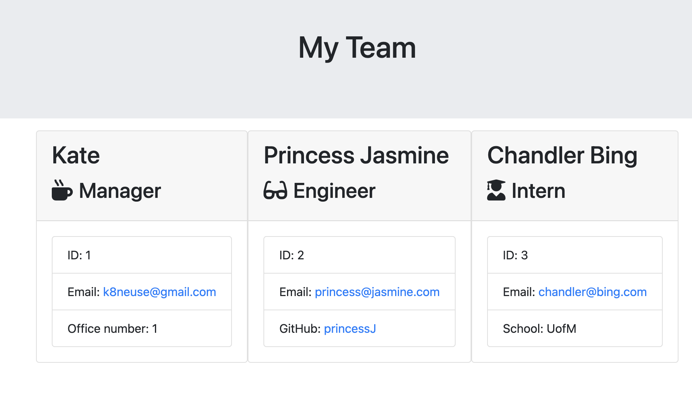

# Team-Generator

This Team generator is built from a command-line application that takes user information about employees on a team. With 
the information given, an html page will be generated and displays the user input data. This application required the use of Jest and Inquirer for testing.

SCREENSHOT

WALKTHROUGH

